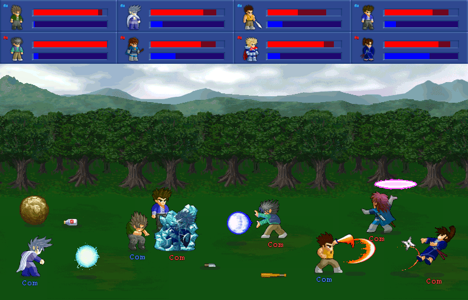

<div align="center">

IDL  
[](https://github.com/ahmetsait/IDL/releases) [](https://github.com/ahmetsait/IDL/releases/latest) [](LICENSE)
===
Instant Data Loader module for [Little Fighter 2](https://lf2.net)
</div>

IDL is a dynamic library that provides an API for parsing and loading data files (`*.dat`) directly to LF2's memory. This module is developed as part of [LF2 IDE](https://github.com/ahmetsait/LF2.IDE).

Dlang API Reference
-------------------
```d
import core.sys.windows.windef : HWND;

enum DataType : int
{
	Object = 0,
	Stage = 1,
	Background = 2,
}

enum ObjectType : int
{
	Char = 0,
	Weapon = 1,
	HeavyWeapon = 2,
	SpecialAttack = 3,
	ThrowWeapon = 4,
	Criminal = 5,
	Drink = 6,
}

struct ObjectData
{
	int id;
	ObjectType type;
	immutable(char)* file;
	int fileLength;
}

struct BackgroundData
{
	int id;
	immutable(char)* file;
	int fileLength;
}

enum MsgType : ubyte
{
	Info,
	Warning,
	Error,
}

alias Logger = extern(C) void function(immutable(char)* message, immutable(char)* title, MsgType messageType);

/// Loads decrypted data to LF2's memory using Read/WriteProcessMemory WinApi
/// functions. It's not possible to load images and sounds for objects. layer
/// bitmaps are supported and bgm works in stages. Other than that, this is pure
/// magic.
extern(C) int instantLoad(
	immutable(char)* data,
	int dataLength,
	int procId,
	DataType dataType,
	int datIndex,
	ObjectType objType,
	HWND hMainWindow,
	Logger logFunc
) nothrow;

alias Dealloc = extern(C) void function(void*) nothrow @nogc;

/// Reads and parses data.txt content, returns the result via its out
/// parameters.
extern(C) int readDataTxt(
	immutable(char)* dataTxtContent,
	int dataTxtLength,
	out ObjectData* objects,
	out int objCount,
	out BackgroundData* backgrounds,
	out int bgCount,
	out Dealloc dealloc,
	HWND hMainWindow
) nothrow;
```

C# P/Invoke Reference
---------------------
```cs
using System;
using System.Text;
using System.Runtime.InteropServices;

public enum DataType : int
{
	Char = 0,
	Stage = 1,
	Background = 2,
}

public enum ObjectType : int
{
	Char = 0,
	Weapon = 1,
	HeavyWeapon = 2,
	SpecialAttack = 3,
	ThrowWeapon = 4,
	Criminal = 5,
	Drink = 6,
}

public struct ObjectData
{
	public int id;
	public ObjectType type;
	public string file;
}

public struct BackgroundData
{
	public int id;
	public string file;
}

[StructLayout(LayoutKind.Sequential)]
unsafe struct ObjectDataRaw
{
	public int id;
	public ObjectType type;
	public byte* file;
	public int fileLength;
}

[StructLayout(LayoutKind.Sequential)]
unsafe struct BackgroundDataRaw
{
	public int id;
	public byte* file;
	public int fileLength;
}

public enum MsgType : byte
{
	Info,
	Warning,
	Error,
}

[UnmanagedFunctionPointer(CallingConvention.Cdecl, CharSet = CharSet.Ansi)]
public delegate void Logger(
	[MarshalAs(UnmanagedType.LPStr)]
	string msg,
	[MarshalAs(UnmanagedType.LPStr)]
	string title,
	MsgType msgType);

[UnmanagedFunctionPointer(CallingConvention.Cdecl, CharSet = CharSet.Ansi)]
public unsafe delegate void Dealloc(void* ptr);

public static class IDL
{
	[DllImport("IDL.dll", EntryPoint = "instantLoad", CallingConvention = CallingConvention.Cdecl, CharSet = CharSet.Ansi)]
	static extern int InstantLoad(
		[MarshalAs(UnmanagedType.LPStr)]
		string data,
		int dataLength,
		int procId,
		DataType dataType,
		int datId,
		ObjectType objType,
		IntPtr hMainWindow,
		[MarshalAs(UnmanagedType.FunctionPtr)]
		Logger logFunc);

	public static int InstantLoad(
		[MarshalAs(UnmanagedType.LPStr)]
		string data,
		int procId,
		DataType dataType,
		int datId,
		ObjectType objType,
		IntPtr hMainWindow,
		Logger logFunc)
	{
		return InstantLoad(data, data.Length, procId, dataType, datId, objType, hMainWindow, logFunc);
	}

	[DllImport("IDL.dll", EntryPoint = "readDataTxt", CharSet = CharSet.Ansi, CallingConvention = CallingConvention.Cdecl)]
	static extern unsafe int ReadDataTxt(
		[MarshalAs(UnmanagedType.LPStr)]
		string dataTxtContent,
		int dataTxtLength,
		out ObjectDataRaw* objects,
		out int objCount,
		out BackgroundDataRaw* backgrounds,
		out int bgCount,
		[MarshalAs(UnmanagedType.FunctionPtr)]
		out Dealloc dealloc,
		IntPtr hMainWindow);

	public unsafe static int ReadDataTxt(
		string dataTxtContent,
		out ObjectData[] objects,
		out BackgroundData[] backgrounds,
		IntPtr hMainWindow)
	{
		int result = ReadDataTxt(
			dataTxtContent,
			dataTxtContent.Length,
			out ObjectDataRaw* objectsRaw,
			out int objCount,
			out BackgroundDataRaw* backgroundsRaw,
			out int bgCount,
			out Dealloc dealloc,
			hMainWindow);
		
		if (result == 0)
		{
			objects = new ObjectData[objCount];
			for (int i = 0; i < objCount; i++)
			{
				objects[i].id = objectsRaw[i].id;
				objects[i].type = objectsRaw[i].type;
				objects[i].file = Encoding.ASCII.GetString(objectsRaw[i].file, objectsRaw[i].fileLength);
			}
			dealloc(objectsRaw);

			backgrounds = new BackgroundData[bgCount];
			for (int i = 0; i < bgCount; i++)
			{
				backgrounds[i].id = backgroundsRaw[i].id;
				backgrounds[i].file = Encoding.ASCII.GetString(backgroundsRaw[i].file, backgroundsRaw[i].fileLength);
			}
			dealloc(backgroundsRaw);
		}
		else
		{
			objects = null;
			backgrounds = null;
		}
		
		return result;
	}
}
```

About Little Fighter 2
----------------------
LF2 is a 2D beat 'em up fighting game made by Marti Wong & Starsky Wong. It is extremely customizable with its data file architecture allowing modders to create characters, weapons, levels and even stories from scratch.

  
See the official website: https://lf2.net
